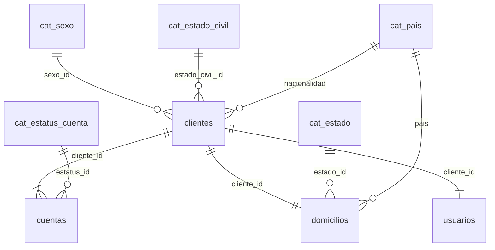

# Banco · Onboarding de clientes personas físicas

API REST en Java para registrar clientes personas físicas, validar su información, abrirles una cuenta
bancaria con saldo inicial y crearles un usuario de acceso con inicio de sesión por JWT.

**Tecnologías:** Java 21 · Spring Boot 4.0.8 (Web MVC, Data JPA/Hibernate 7, Validation, Security + JWT) ·
PostgreSQL 16 · Flyway · Maven · Lombok · OpenAPI/Swagger · JUnit 6, Mockito, MockMvc y PostgreSQL embebido.

| Entregable | Dónde está |
|---|---|
| Diagrama entidad-relación | [`docs/diagrama-er.png`](docs/diagrama-er.png) (también `.svg`, fuente `.dot` y versión Mermaid más abajo) |
| Script de creación de la base de datos | [`database/schema.sql`](database/schema.sql) · migraciones Flyway en `src/main/resources/db/migration` |
| Diccionario de datos | [`docs/diccionario-de-datos.md`](docs/diccionario-de-datos.md) |
| Código fuente | `src/main/java/com/example/banco` (98 archivos: 59 clases, 20 records, 9 anotaciones, 7 interfaces y 3 enums) |
| Pruebas automatizadas | `src/test/java` (27 clases, 182 métodos de prueba = 282 casos al expandir los parametrizados) · colección de Postman en [`docs/postman`](docs/postman) |
| Evidencias de pruebas | [`docs/evidencias`](docs/evidencias/README.md) |
| Documento técnico | [`docs/documento-tecnico.pdf`](docs/documento-tecnico.pdf) (copia en PDF del documento técnico) |

---

## 1. Requisitos

- **JDK 21 o superior** (`java -version`). Maven no hace falta: el proyecto trae el *Maven Wrapper* (`mvnw`).
- **PostgreSQL 15 o superior** (probado en 16) para ejecutar la API.
- Opcional: **Node.js** para correr la colección de Postman desde la terminal, o la app de **Postman**.
- Opcional: **Docker** para levantar todo con un comando.

## 2. Arranque rápido

**1) Crear la base de datos** (una sola vez):

```bash
psql -U postgres -c "CREATE DATABASE banco_onboarding ENCODING 'UTF8' TEMPLATE template0"
```

Las tablas se crean solas al arrancar la API (Flyway). Si prefieres crearlas a mano, ejecuta el script:
`psql -U postgres -d banco_onboarding -f database/schema.sql` (también funciona en pgAdmin o DBeaver).

> **¿Ya habías creado el esquema `onboarding` con un script anterior?** Bórralo antes de arrancar, porque
> los tipos cambiaron (por ejemplo, las llaves ahora son `INTEGER`):
> `psql -U postgres -d banco_onboarding -c "DROP SCHEMA onboarding CASCADE"`

**2) Arrancar la API.** Si la contraseña de tu usuario `postgres` no es `postgres`, defínela antes:

```powershell
# Windows (PowerShell)
$env:DB_PASSWORD = "tu-contraseña"
.\mvnw.cmd spring-boot:run
```

```bash
# Linux / macOS
export DB_PASSWORD="tu-contraseña"
./mvnw spring-boot:run
```

**3) Probarla:** abre **http://localhost:8080/swagger-ui.html**. Ahí puedes registrar un cliente con
`POST /clientes`, iniciar sesión con `POST /auth/login`, copiar el token en el botón **Authorize** y usar
el resto de los endpoints.

Opcional: `database/datos-prueba.sql` carga 4 clientes de ejemplo (contraseña de todos: `Segura#2026`):

```bash
psql -U postgres -d banco_onboarding -f database/datos-prueba.sql
```

## 3. Pruebas y evidencias

| Qué | Windows | Linux / macOS |
|---|---|---|
| Todas las pruebas (unitarias + integración) y cobertura | `.\mvnw.cmd verify` | `./mvnw verify` |
| Lo mismo y además guardar la evidencia en `docs/evidencias` | `powershell -ExecutionPolicy Bypass -File scripts\evidencias-pruebas.ps1` | `./scripts/evidencias-pruebas.sh` |
| Colección de Postman contra la API en marcha | `powershell -ExecutionPolicy Bypass -File scripts\evidencias-postman.ps1` | `./scripts/evidencias-postman.sh` |

- Las **pruebas de integración** levantan un PostgreSQL 16 embebido (no hace falta Docker ni la base local)
  y prueban la API completa con MockMvc: registro, validaciones, consultas, actualización, baja lógica,
  login, JWT, concurrencia y atomicidad.
- La **cobertura** queda en `target/site/jacoco/index.html`.
- La **colección de Postman** (`docs/postman`) genera CURP, RFC y correos nuevos en cada ejecución, así que
  se puede correr las veces que sea. Importa también `local.postman_environment.json`.
- En Linux, no ejecutes las pruebas como `root`: PostgreSQL embebido no arranca con ese usuario.

## 4. Endpoints

Base: `http://localhost:8080`. Los marcados con 🔒 requieren el encabezado `Authorization: Bearer <token>`.

| Método | Ruta | Descripción |
|---|---|---|
| POST | `/clientes` | Registra cliente + domicilio + cuenta ACTIVA + usuario (pública). Responde 201 y `Location`. |
| POST | `/auth/login` | Inicia sesión con correo y contraseña; devuelve el JWT (pública). |
| GET 🔒 | `/clientes?page=0&size=20&sort=id,asc` | Todos los clientes, paginado. |
| GET 🔒 | `/clientes/{id}` | Cliente por ID. |
| GET 🔒 | `/clientes/curp/{curp}` | Cliente por CURP. |
| GET 🔒 | `/clientes/rfc/{rfc}` | Cliente por RFC. |
| GET 🔒 | `/clientes/correo/{correo}` | Cliente por correo. |
| GET 🔒 | `/clientes/cuenta/{numeroCuenta}` | Cliente por número de cuenta. |
| GET 🔒 | `/clientes/activos` | Clientes activos, paginado. |
| GET 🔒 | `/clientes/registrados?desde=2026-01-01&hasta=2026-12-31` | Registrados en un rango de fechas (incluye ambos días). |
| PUT 🔒 | `/clientes/{id}` | Actualiza datos personales, de contacto, domicilio y laborales. CURP, RFC y número de cuenta no cambian. |
| DELETE 🔒 | `/clientes/{id}` | Baja lógica: cliente inactivo, cuentas INACTIVA, usuario inactivo. Responde 204. |
| GET 🔒 | `/cuentas/{numeroCuenta}` | Cuenta por número. |
| GET 🔒 | `/cuentas/{numeroCuenta}/saldo` | Saldo de la cuenta. |
| GET 🔒 | `/cuentas/activas` | Cuentas activas, paginado. |
| GET 🔒 | `/usuarios/{id}` | El propio usuario (sin contraseña). Otro usuario → 403. |
| PUT 🔒 | `/usuarios/{id}/password` | Cambia la contraseña pidiendo la actual; invalida los tokens anteriores. |
| GET | `/catalogos/estados`, `/paises`, `/sexos`, `/estados-civiles`, `/estatus-cuenta` | Valores válidos para el formulario (públicos). |
| GET | `/actuator/health`, `/actuator/info`, `/swagger-ui.html`, `/v3/api-docs` | Salud y documentación (públicos; la documentación se apaga en el perfil `prod`). |

La actividad pide que los endpoints protegidos exijan un usuario autenticado y no define roles: con un token
válido se puede consultar, modificar o dar de baja a cualquier cliente. `/usuarios/{id}` sí verifica que el
usuario sea el propio (403 si es de otra persona, 404 si no existe).

### Ejemplo de registro

```json
POST /clientes
{
  "nombre": "María", "segundoNombre": "Fernanda", "apellidoPaterno": "López", "apellidoMaterno": "Hernández",
  "fechaNacimiento": "1995-08-21", "curp": "LOHF950821MGTPRR08", "rfc": "LOHF950821QK5",
  "sexo": "M", "nacionalidad": "MX", "estadoCivil": "SOLTERO",
  "correo": "maria.lopez@ejemplo.com", "telefonoMovil": "4731234567", "telefonoAlterno": "4737654321",
  "domicilio": { "calle": "Calle Hidalgo", "numeroExterior": "123", "numeroInterior": "4B", "colonia": "Centro",
                 "municipio": "Guanajuato", "estadoId": 11, "codigoPostal": "36000", "pais": "MX" },
  "ocupacion": "Ingeniera de software", "empresa": "Tecnologías del Bajío SA de CV",
  "ingresoMensual": 35000.00, "password": "Segura#2026"
}
```

Valores de catálogo: `sexo` H, M o X · `estadoCivil` SOLTERO, CASADO, UNION_LIBRE, DIVORCIADO, VIUDO, SEPARADO ·
`estadoId` clave INEGI de 1 a 32 (11 = Guanajuato) · `nacionalidad` código ISO de 2 letras.

### Formato de los errores

Todos los errores usan el mismo JSON (RFC 9457, `application/problem+json`), con un `codigo` estable y,
si son de validación, la lista de campos:

```json
{
  "title": "Solicitud inválida", "status": 400, "detail": "La solicitud tiene 1 error(es) de validación",
  "instance": "/clientes", "codigo": "ERROR_VALIDACION", "timestamp": "2026-10-06T18:20:00Z",
  "requestId": "4f6c…", "errores": [ { "campo": "telefonoMovil", "mensaje": "debe contener exactamente 10 dígitos" } ]
}
```

| HTTP | Códigos |
|---|---|
| 400 | `ERROR_VALIDACION`, `CAMPO_NO_MODIFICABLE`, `PASSWORD_INVALIDA`, `JSON_INVALIDO`, `PARAMETRO_INVALIDO`, `PARAMETRO_FALTANTE` |
| 401 | `CREDENCIALES_INVALIDAS`, `NO_AUTENTICADO`, `TOKEN_INVALIDO`, `TOKEN_RECHAZADO` |
| 403 | `USUARIO_INACTIVO`, `ACCESO_DENEGADO` |
| 404 | `CLIENTE_NO_ENCONTRADO`, `CUENTA_NO_ENCONTRADA`, `USUARIO_NO_ENCONTRADO` |
| 409 | `CLIENTE_YA_REGISTRADO`, `CURP_DUPLICADA`, `RFC_DUPLICADO`, `CORREO_DUPLICADO`, `CLIENTE_INACTIVO`, `CONFLICTO_CONCURRENCIA` |
| 429 | `DEMASIADOS_INTENTOS` (5 intentos fallidos de login bloquean ese correo 15 minutos) |

## 5. Reglas de negocio y dónde se garantizan

Cada regla se valida en la API (respuesta clara) **y** en la base de datos (nadie puede saltársela con SQL).

| Regla | API (Java) | Base de datos |
|---|---|---|
| Mayor de edad; fecha de nacimiento no futura | `@MayorDeEdad` | trigger `trg_clientes_1_validar` (reglas `tg_clientes_mayor_edad` y `tg_clientes_fecha_futura`) |
| CURP, RFC y correo únicos | `ClienteService` → 409 | `uq_clientes_curp`, `uq_clientes_rfc`, `uq_clientes_correo` |
| Nombres: letras y espacios, 2 a 50 | `@NombrePersona` | `fn_nombre_valido` en CHECK |
| CURP de 18 y RFC de 12/13 con expresión regular; fecha igual a la de nacimiento | `@Curp`, `@Rfc`, `ClienteService` | `ck_clientes_curp`, `ck_clientes_rfc`, `ck_clientes_curp_fecha`, `ck_clientes_rfc_fecha` |
| Correo válido, máximo 100 | `@CorreoElectronico` | `ck_clientes_correo` |
| Teléfono de 10 dígitos; código postal de 5 | `@Telefono`, `@CodigoPostal` | `ck_clientes_telefono_*`, `ck_domicilios_cp` |
| Ingreso mensual mayor a cero | `@DecimalMin` | `ck_clientes_ingreso` |
| Cuenta automática, número único, ACTIVA, saldo inicial del sistema no negativo | `CuentaService`, `app.cuenta.saldo-inicial` | `fn_generar_numero_cuenta` (secuencia + Luhn), `uq_cuentas_numero`, `ck_cuentas_saldo` |
| Solo clientes activos con cuentas activas | `ClienteService.darDeBaja` | triggers `trg_clientes_baja_cascada` y `trg_cuentas_1_validar` (regla `tg_cuentas_cliente_inactivo`) |
| CURP, RFC y número de cuenta no se modifican | `CampoNoModificableException` | triggers `trg_clientes_1_validar` y `trg_cuentas_1_validar` (reglas `tg_*_inmutable`) |
| Baja lógica (sin borrado físico) que inactiva usuario y cuentas | `DELETE` → `darDeBaja` | `trg_clientes_baja_cascada`; los triggers `trg_*_0_sin_borrado` impiden el DELETE físico (error `tg_baja_logica`) |
| Usuario automático: correo como usuario, BCrypt, uno por cliente, activo | `UsuarioService` | `uq_usuarios_cliente`, `uq_usuarios_correo`, `ck_usuarios_password_bcrypt` |
| Contraseña: 8+, mayúscula, minúscula, número y especial | `@PasswordSegura` | (solo se guarda el hash) |
| Login con usuario existente, activo y credenciales correctas; JWT | `AuthService`, `JwtService` | — |
| Solo usuarios autenticados en endpoints protegidos | `SecurityConfig` | — |

## 6. Configuración

Los secretos nunca están en el código: llegan por variables de entorno (ver [`.env.example`](.env.example)).

| Variable | Por omisión (perfil dev) | Descripción |
|---|---|---|
| `DB_URL` | `jdbc:postgresql://localhost:5432/banco_onboarding` | Conexión a PostgreSQL |
| `DB_USER` / `DB_PASSWORD` | `postgres` / `postgres` | Credenciales de la base |
| `JWT_SECRET` | secreto de desarrollo | Mínimo 32 caracteres. **Obligatorio en producción** |
| `JWT_EXPIRACION` | `60m` | Vigencia del token |
| `SALDO_INICIAL` | `1000.00` | Saldo de apertura definido por el sistema (no puede ser negativo) |
| `CORS_ORIGENES` | `http://localhost:3000,http://localhost:5173` | Orígenes permitidos para un frontend |
| `SPRING_PROFILES_ACTIVE` | `dev` | `prod` en producción (logs JSON, Swagger apagado, variables obligatorias) |

## 7. Base de datos



Decisiones principales (detalle en el documento técnico, el diccionario de datos y la evidencia 06):

- Llaves `INTEGER` (4 bytes): alcanzan para 2,147 millones de registros; `BIGINT` gastaría 4 bytes más en cada fila y en cada llave foránea.
- Catálogos pequeños (sexo, estado civil, estatus, entidad) en `SMALLINT` con llave foránea, en vez de repetir texto.
- Dinero en `NUMERIC` (exacto), fechas en `DATE` y `TIMESTAMPTZ`, textos en `VARCHAR(n)` con `CHECK` de formato.
- Columnas ordenadas por alineación (dos `INTEGER`, luego `TIMESTAMPTZ`, `DATE`, `SMALLINT`, `BOOLEAN` y al final los textos) para no desperdiciar bytes de relleno; índices parciales para activos.
- Domicilio con llave primaria compartida (1:1 sin columna ni índice extra).
- Número de cuenta de 10 dígitos: 9 de una secuencia + dígito verificador Luhn (detecta errores de captura).
- Rol `rol_app_onboarding` de mínimo privilegio: sin `DELETE` ni `TRUNCATE`.

## 8. Estructura del proyecto

```
├── database/                 schema.sql, datos de prueba, consultas, pruebas de reglas y carga de volumen
├── docs/                     documento técnico (PDF), diagrama ER, diccionario de datos, Postman y evidencias
├── scripts/                  generación de evidencias (PowerShell y Bash)
├── src/main/java/com/example/banco
│   ├── config/               seguridad, JWT, OpenAPI y propiedades validadas al arrancar
│   ├── controller/           API REST (clientes, cuentas, auth, usuarios, catálogos)
│   ├── dto/request|response/ datos de entrada (con validaciones) y de salida
│   ├── entity/               Cliente, Domicilio, Cuenta, Usuario, catálogos y enums
│   ├── exception/            excepciones personalizadas y manejador global de errores
│   ├── mapper/               conversión entre DTOs y entidades
│   ├── repository/           Spring Data JPA (consultas por CURP, RFC, correo, rangos...)
│   ├── security/             JWT, usuario autenticado, bloqueo por intentos fallidos
│   ├── service/              reglas de negocio
│   ├── util/                 Luhn, política de contraseñas, CURP/RFC, normalización de texto
│   ├── validation/           anotaciones de validación propias
│   └── web/                  identificador de petición y ordenamiento permitido
├── src/main/resources        application*.yml y migraciones Flyway (V1 esquema, V2 catálogos, V3 rol)
└── src/test/java             pruebas unitarias (*Test) y de integración (*IT)
```

## 9. Docker (opcional)

```bash
docker compose up --build
```

Levanta PostgreSQL 16 y la API (perfil `prod`, con Swagger habilitado solo para esta prueba local) en
http://localhost:8080/swagger-ui.html.

## 10. Solución de problemas

| Síntoma | Solución |
|---|---|
| `password authentication failed for user "postgres"` | Define `DB_PASSWORD` con tu contraseña antes de `mvnw spring-boot:run`. |
| `database "banco_onboarding" does not exist` | Crea la base (paso 2.1). |
| `Schema-validation: wrong column type ... found [int8]` | El esquema se creó con un script anterior: `DROP SCHEMA onboarding CASCADE` y vuelve a arrancar. |
| `Port 8080 was already in use` | Cierra la otra aplicación o arranca con `--server.port=8081` (`mvnw spring-boot:run -Dspring-boot.run.arguments=--server.port=8081`). |
| `JAVA_HOME is not set` / versión de Java | Instala el JDK 21 y define `JAVA_HOME`. |
| Las pruebas fallan al iniciar PostgreSQL embebido en Linux | No las ejecutes como `root`. |
